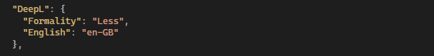

# MP.LanguageManager.DeepLTranslate

## Description

This extension for Optimizely CMS allows EPiServer.Labs.LanguageManager to translate content through DeepL Translate.

## Configuration

To enable LanguageManager to use the DeepL Translator Provider, ensure that it is selected as your automated translation option in the settings of the Language Manager.

You will need a Subscription Key for this extension to function - you can create one at https://www.deepl.com/pro-api

A &lt;DeepL&gt;&lt;Formality&gt; Configuration element in appSettings can be used to control the formality of translations, with options Less, More, PreferLess, PreferMore, Default.

An &lt;DeepL&gt;&lt;English&gt; Configuration element in appSettings controls whether to translate to en-GB or en-US where "En" is your target language in Optimizely.

## Usage

Install the Languages gadget and then auto-translate all your content through DeepL!

