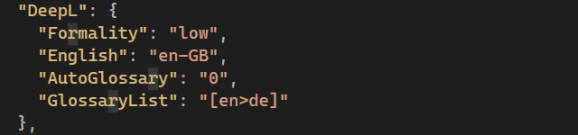

# MP.LanguageManager.DeepLTranslate

## Description

This package extends the Optimizely CMS Language Manager to allow translations through the DeepL API.

## Configuration

To use the DeepL Translator to perform automated translations make sure it's selected as Translator Provider in the settings of the Language Manager.

You will need a Authentication Key for the DeepL API - you can create one at https://www.deepl.com/pro-api

## AppSettings

Add the following to startup.cs.

services.Configure<DeepLOptions>(_configuration.GetSection("DeepL"));

Thent the following options are valid in appsettings.json 

A &lt;DeepL&gt;&lt;Formality&gt; Configuration element in appSettings can be used to control the formality of translations, with options Less, More, PreferLess, PreferMore, Default - a pro license is required for any other setting than Default.

A &lt;DeepL&gt;&lt;English&gt; Configuration element in appSettings controls whether to translate to en-GB or en-US where "En" is your target language in Optimizely.

A &lt;DeepL&gt;&lt;AutoGlossary&gt; Confguration element in appSettings controls whether ANY available configured glossary in the DeepL account will be used. Options are 0 (off) and 1 (on).

A &lt;DeepL&gt;&lt;GlossaryList&gt; Confguration element in appSettings controls which specific configured glossaries from DeepL account will be used where AutoGlossary is set to 0. Format is comma delimited [2 letter source lang > 2 letter target lang] i.e. [en>de].

## Usage

- Install the Languages Gadget (https://nuget.optimizely.com/package/?id=EPiServer.Labs.LanguageManager)
- Set DeepL Web Translator as your Language Manager Translator
- Set your Authentication/Subscription key
- Use the Langauges Gadget to auto-translate all your content through DeepL!

